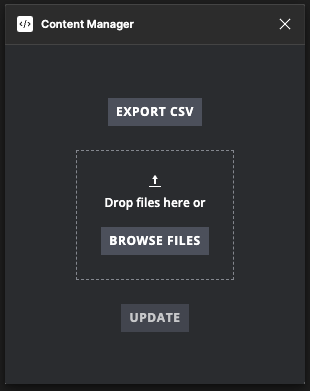

Figma plugin to export text content to CSV and import back to update.

Within CSV, edit "characters" column to update original text, or add additional column, e.g. "v2", so multiple revisions of the same text node can be updated and reviewed in Figma.

Text revisions are stored in Figma document `figma.root` object via [`setSharedPluginData`](https://www.figma.com/plugin-docs/api/properties/nodes-setsharedplugindata/) API so any other user can see the revisions without additional file or system. This is currently only enabled via [Relaunch button](https://www.figma.com/plugin-docs/manifest/#relaunchbuttons) on text nodes having multiple revisions of text.
